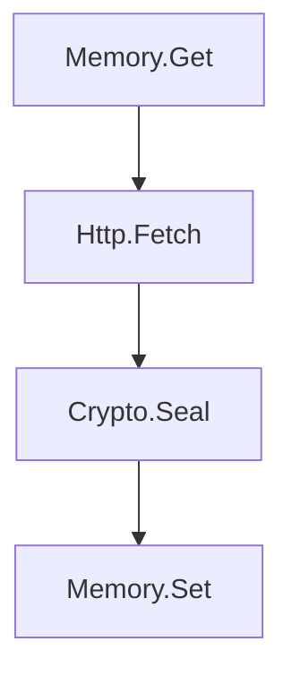

# RFC 0024: Reactive Event-Driven Kernel Architecture

## 1. Summary

This RFC defines the event schema and NDJSON protocol for PromptWar̊e ØS reactive kernel. It establishes **OsEvent** as the universal interface between LLM intent (natural language) and deterministic execution (kernel syscalls), enabling a single data model to span both the Prompt Kernel (Ring 0) and Software Kernel (Ring 1).

The design adopts CQRS (Command Query Responsibility Segregation), Event Sourcing lineage tracking (correlation/causation), and industry standards (CloudEvents, EventStoreDB) to minimize cognitive load for both LLM models and human developers.

---

## 2. Motivation

### The Intent ↔ Precision Gap

PromptWar̊e ØS is an AI-Native Operating System designed to run on Large Language Models (LLMs). The core challenge is bridging:

- **LLM Nature**: Probabilistic, natural language, text-in/text-out (Intent)
- **Traditional Computing**: Deterministic, structured, typed APIs (Precision)

### Problems with Imperative APIs

Traditional syscall interfaces require LLMs to:
1. Memorize function signatures (parameter types, order, optionality)
2. Handle language-specific error patterns (exceptions, error codes, null checks)
3. Understand implicit dependencies (global state, configuration)
4. Parse complex return types (nested objects, unions, generics)

**Cognitive Load**: 11 different syscall APIs × N parameters each = High complexity

### The Event-Driven Solution

By unifying all interactions as **JSON events**, PromptWar̊e ØS achieves:
- **Single schema to learn**: 1 event envelope with 5 behavioral types
- **Self-describing payloads**: LLMs query `Sys.Describe` for JSON Schema
- **Uniform error handling**: All failures are `error` type events
- **Universal tracing**: Correlation/causation IDs link workflow chains

**Cognitive Load Reduction**: 11 APIs → 1 Event Schema = **91% reduction**

### Alignment Across Kernels

Event-driven architecture enables the Prompt Kernel (natural language instructions in `KERNEL.md`) and Software Kernel (TypeScript code) to communicate via the **same data model**:

```
Prompt Kernel: "Fetch the API and seal the result"
         ↓
    OsEvent: {"type":"command", "name":"Http.Fetch", "payload":{...}}
         ↓
Software Kernel: Executes handler, returns OsEvent response
```

**Zero translation layer** = Zero loss of intent.

---

## 3. Goals & Non-Goals

### Goals

1. **Specify observable event behavior** in a language-agnostic manner
2. **Enable independent implementations** (TypeScript, Python, Rust, Go)
3. **Optimize for LLM comprehension** (JSON, semantic field names, introspectable)
4. **Reduce system complexity** (uniform error handling, single protocol)
5. **Support workflow tracing** (correlation/causation lineage)

### Non-Goals

1. **Implementation language**: Specification is language-neutral
2. **Storage backend**: Event persistence is optional (out of scope for v1)
3. **Middleware architecture**: TransformStreams are an implementation detail
4. **Schema versioning**: V1 allows breaking changes (defer to future RFC)
5. **Binary protocols**: NDJSON only (CBOR/MessagePack deferred)

---

## 4. Detailed Design

### 4.1 Event Schema (Normative)

An **OsEvent** is a JSON object with the following structure:

```json
{
  "type": "<behavioral-type>",
  "name": "<event-name>",
  "payload": <json-value>,
  "metadata": {
    "id": "<unique-id>",
    "timestamp": <unix-epoch-ms>,
    "correlation": "<workflow-id>",
    "causation": "<parent-event-id>"
  }
}
```

#### 4.1.1 Required Fields

| Field | Type | Description | Requirement |
|-------|------|-------------|-------------|
| `type` | String (Enum) | Behavioral envelope type | MUST be one of: `command`, `query`, `event`, `response`, `error` |
| `name` | String | Domain event name in dot notation | MUST match pattern `^[A-Z][a-zA-Z0-9]*\.[A-Z][a-zA-Z0-9]*$` (e.g., `Memory.Set`) |
| `payload` | Any | Data payload or error object | MUST be JSON-serializable (no functions, symbols, undefined) |
| `metadata` | Object | Event metadata for tracing | MUST be present and contain required subfields |

#### 4.1.2 Metadata Subfields

| Field | Type | Description | Requirement |
|-------|------|-------------|-------------|
| `metadata.id` | String | Unique event identifier | MUST be present, SHOULD be globally unique (e.g., UUID, shortId) |
| `metadata.timestamp` | Number | Unix epoch milliseconds | MUST be present, MUST be non-negative integer |
| `metadata.correlation` | String | Workflow/session correlation ID | MAY be present, if present MUST be non-empty string |
| `metadata.causation` | String | Direct parent event ID | MAY be present, if present MUST reference a valid event ID |

---

### 4.2 Behavioral Envelope Types (Normative)

The `type` field determines the **semantic intent** of the event and imposes behavioral constraints on implementations.

#### 4.2.1 Command (`type: "command"`)

**Semantics**: "Do this" — A request to mutate observable state.

**Requirements**:
- **MUST** be retriable: Sending the same command twice with the same idempotency key (if supported) MUST produce identical observable effects.
- **SHOULD** be handled asynchronously: Implementations MAY defer execution and return immediately.
- Implementations MUST emit either a `response` or `error` event as the outcome.

**Examples**: `Memory.Set`, `Http.Fetch`, `Crypto.Seal`

#### 4.2.2 Query (`type: "query"`)

**Semantics**: "Get this" — A request to retrieve state without mutation.

**Requirements**:
- **MUST NOT** mutate observable state: Sending a query MUST NOT change any data visible to future queries or commands.
- **MUST** be deterministic: Same input + same state → same output.
- Implementations MUST emit either a `response` or `error` event as the outcome.

**Examples**: `Memory.Get`, `Memory.List`, `Sys.Describe`

#### 4.2.3 Event (`type: "event"`)

**Semantics**: "This happened" — An immutable notification of a past occurrence.

**Requirements**:
- **MUST** use past tense or perfect aspect in naming: `Job.Completed`, `File.Created`, `User.Authenticated`.
- **MUST** be immutable: Once emitted, the event's payload and metadata MUST NOT change.
- Implementations MAY ignore events (they are notifications, not commands).

**Examples**: `Job.Completed`, `Memory.Synchronized`, `Daemon.Started`

#### 4.2.4 Response (`type: "response"`)

**Semantics**: "Here is the outcome" — The successful result of a command or query.

**Requirements**:
- **MUST** include `metadata.causation`: The ID of the command/query that triggered this response.
- **SHOULD** use the same `name` as the originating request (e.g., `Memory.Set` command → `Memory.Set` response).
- `payload` contains the success result (specific to each syscall).

**Examples**: Response to `Memory.Get` with retrieved value, response to `Crypto.Seal` with ciphertext.

#### 4.2.5 Error (`type: "error"`)

**Semantics**: "This failed" — The failure outcome of a command or query.

**Requirements**:
- **MUST** include `metadata.causation`: The ID of the command/query that failed.
- **SHOULD** use the same `name` as the originating request.
- `payload` **SHOULD** include a `message` field (string) describing the error in human-readable form.
- `payload` **MAY** include additional fields: `code` (string), `details` (object), `stack` (string).

**Example Payload**:
```json
{
  "message": "Key not found: /notes/123",
  "code": "NOT_FOUND",
  "details": {"key": "/notes/123"}
}
```

---

### 4.3 NDJSON Protocol (Normative)

#### 4.3.1 Framing

Events MUST be transmitted as **Newline Delimited JSON (NDJSON)**:
- Each event is serialized as a single JSON object on one line.
- Lines are terminated with a newline character (`\n`, U+000A).
- Encoding MUST be UTF-8.

**Example**:
```
{"type":"command","name":"Echo","payload":{"message":"hello"},"metadata":{"id":"abc123","timestamp":1735000000000}}
{"type":"response","name":"Echo","payload":{"echo":"hello"},"metadata":{"id":"def456","timestamp":1735000001000,"causation":"abc123"}}
```

#### 4.3.2 Line Length

- Individual lines **SHOULD NOT** exceed 1 MB (1,048,576 bytes).
- Implementations **SHOULD** reject lines exceeding this limit by emitting an `error` event with `code: "LINE_TOO_LONG"`.
- Implementations **MAY** support larger lines if explicitly configured.

#### 4.3.3 Parsing

Implementations MUST handle the following cases:

1. **Valid JSON**: Parse and validate against event schema.
2. **Invalid JSON**: Emit `error` event with `code: "INVALID_JSON"`, continue processing next line.
3. **Schema violation**: Emit `error` event with `code: "SCHEMA_VIOLATION"`, include validation details in `payload.details`.
4. **Partial read**: Buffer incomplete lines until newline is received.

**Error Recovery**: Implementations MUST continue processing subsequent lines after encountering invalid input.

---

### 4.4 Event Name Dot Notation (Normative)

#### 4.4.1 Pattern

Event names MUST follow the **Domain.Action** pattern:

```
<Domain>.<Action>
```

- **Domain**: PascalCase noun (e.g., `Memory`, `Crypto`, `Job`, `Syscall`)
- **Action**: PascalCase verb or noun (e.g., `Get`, `Set`, `Seal`, `Completed`)

**Regular Expression**:
```
^[A-Z][a-zA-Z0-9]*\.[A-Z][a-zA-Z0-9]*$
```

**Examples**:
- ✅ `Memory.Get`
- ✅ `Http.Fetch`
- ✅ `Crypto.Seal`
- ✅ `Job.Completed`
- ❌ `memory.get` (lowercase)
- ❌ `MemoryGet` (no dot separator)
- ❌ `Memory.get` (Action not PascalCase)

#### 4.4.2 Rationale

Dot notation provides:
1. **Namespace clarity**: Domain separates concerns (e.g., all `Memory.*` events relate to storage)
2. **LLM parseability**: Easier for models to extract intent vs. Unix paths (`memory/get`)
3. **Industry standard**: Matches EventStoreDB, gRPC, Protobuf conventions
4. **Tool support**: Enables autocomplete, schema generation, linting

---

### 4.5 Correlation and Causation Semantics (Normative)

#### 4.5.1 Correlation

**Purpose**: Track all events belonging to a single workflow, session, or user request.

**Requirements**:
- All events in a workflow **SHOULD** share the same `metadata.correlation` value.
- The correlation ID **SHOULD** be generated at the workflow entry point (e.g., user request).
- Correlation IDs **SHOULD** persist across syscall boundaries (e.g., `Memory.Get` → `Http.Fetch` → `Crypto.Seal` all share correlation).

**Example Workflow**:
```
Event 1: {name: "Memory.Get", correlation: "user-req-123", causation: null}
Event 2: {name: "Http.Fetch", correlation: "user-req-123", causation: "event-1-id"}
Event 3: {name: "Crypto.Seal", correlation: "user-req-123", causation: "event-2-id"}
```

#### 4.5.2 Causation

**Purpose**: Track the **direct parent** event that triggered this event.

**Requirements**:
- Response and error events **MUST** set `metadata.causation` to the ID of the originating command/query.
- Chained events **SHOULD** set `metadata.causation` to the immediate predecessor.
- If an event has no parent (e.g., user-initiated command), `causation` **MAY** be omitted or null.

**Determinism**: Given an event `E` with `causation: "P"`, there MUST exist a prior event with `id: "P"` in the same stream or workflow.

---

### 4.6 Validation Requirements (Normative)

#### 4.6.1 Schema Validation

Implementations MUST validate incoming events against the schema defined in Section 4.1 before execution.

**Validation Points**:
1. **Structural**: Presence of required fields (`type`, `name`, `payload`, `metadata`)
2. **Type checking**: `type` is a valid enum value, `timestamp` is a number, etc.
3. **Pattern matching**: `name` matches dot notation regex
4. **Payload serialization**: `payload` is JSON-serializable (no functions, symbols, undefined)

#### 4.6.2 Validation Failures

When validation fails, implementations MUST:
1. **NOT** execute the handler
2. Emit an `error` event with:
   - `type: "error"`
   - `name: "Validation.Failed"` (or original event name if parseable)
   - `payload.message`: Human-readable error description
   - `payload.code`: `"SCHEMA_VIOLATION"`
   - `payload.details`: Object containing validation errors
   - `metadata.causation`: ID of the invalid event (if available)

**Example Error Event**:
```json
{
  "type": "error",
  "name": "Validation.Failed",
  "payload": {
    "message": "Missing required field: type",
    "code": "SCHEMA_VIOLATION",
    "details": {"field": "type", "expected": "string"}
  },
  "metadata": {
    "id": "err-123",
    "timestamp": 1735000002000,
    "causation": "bad-event-id"
  }
}
```

---

### 4.7 Error Handling (Normative)

#### 4.7.1 Fail-Safe Principle

Implementations MUST treat errors as **events**, not exceptions:
- Syscall handler errors **MUST NOT** crash the kernel or stream.
- All failures **MUST** result in an `error` type event being emitted.
- The stream **MUST** continue processing subsequent events after an error.

#### 4.7.2 Error Event Requirements

Error events (Section 4.2.5) MUST include:
- `type: "error"`
- `name`: Same as the failed command/query (or `"Validation.Failed"` for schema errors)
- `payload.message`: Human-readable error description
- `metadata.causation`: ID of the event that caused the error

Error events **SHOULD** include:
- `payload.code`: Machine-readable error code (e.g., `"NOT_FOUND"`, `"UNAUTHORIZED"`)
- `payload.details`: Additional context (e.g., failed validation rules, stack traces)

#### 4.7.3 Error Codes

Implementations **SHOULD** use consistent error codes across syscalls:

| Code | Meaning | Example |
|------|---------|---------|
| `SCHEMA_VIOLATION` | Event schema validation failed | Missing `type` field |
| `NOT_FOUND` | Requested resource does not exist | `Memory.Get` for non-existent key |
| `INVALID_INPUT` | Handler input validation failed | Malformed URL in `Http.Fetch` |
| `UNAUTHORIZED` | Insufficient permissions | Future auth-protected syscalls |
| `INTERNAL_ERROR` | Unexpected handler failure | Uncaught exception in handler |

---

### 4.8 Introspection via Sys.Describe (Informational)

Implementations **SHOULD** provide a `Sys.Describe` syscall that returns JSON Schema for any registered event name.

**Example Request**:
```json
{"type":"query","name":"Sys.Describe","payload":{"name":"Memory.Set"},"metadata":{...}}
```

**Example Response**:
```json
{
  "type": "response",
  "name": "Sys.Describe",
  "payload": {
    "name": "Memory.Set",
    "type": "command",
    "input": {
      "type": "object",
      "properties": {
        "key": {"type": "string"},
        "value": {"type": "string"}
      },
      "required": ["key", "value"]
    },
    "output": {
      "type": "object",
      "properties": {
        "success": {"type": "boolean"}
      }
    }
  },
  "metadata": {...}
}
```

**Purpose**: Enables LLMs and tools to discover syscall contracts at runtime without consulting external documentation.

---

## 5. Compatibility

### 5.1 PromptWar̊e ØS RFCs

This RFC is compatible with and builds upon:

- **RFC 0022 (STOP Protocol)**: Semantic field names (`correlation` vs `corr_id`) optimize token clarity without cost increase.
- **RFC 0016 (Crypto Primitives)**: `Crypto.Seal`, `Crypto.Open`, `Crypto.Derive` use event payloads for inputs/outputs.
- **RFC 0018 (Kernel Memory)**: `Memory.Get/Set/Delete/List` use CQRS command/query separation.
- **RFC 0023 (Syscall Bridge)**: Inline, client, and daemon modes all transmit events via NDJSON protocol.

### 5.2 Industry Standards

This RFC aligns with:

- **CloudEvents**: Event envelope structure (`type`, `payload`, `metadata`).
- **EventStoreDB**: Dot notation, causation/correlation lineage.
- **JSON:API**: Uniform error response structure (`message`, `code`, `details`).
- **CQRS**: Command/Query behavioral separation.

### 5.3 Backward Compatibility

**Breaking Change Policy**: v1.0 prioritizes rapid iteration over stability. This RFC allows breaking changes to the event schema without versioning.

**Future Compatibility**: When schema versioning is needed, a future RFC will define:
- `metadata.schemaVersion` field
- Migration strategies
- Deprecation timelines

---

## 6. Rationale

### 6.1 Why JSON (Not Binary)?

**Decision**: Use JSON for event payloads, not binary formats (Protobuf, MessagePack, CBOR).

**Rationale**:
1. **LLM-native**: LLMs generate and parse JSON with near-perfect accuracy.
2. **Human-readable**: Developers can inspect events without decoding tools.
3. **Universal**: Supported by every programming language and platform.
4. **Debuggable**: `console.log`, `stderr`, and shell pipes work out-of-the-box.

**Tradeoff**: JSON is 10-20% larger than binary, but the cognitive clarity justifies the overhead for an AI-native OS.

### 6.2 Why NDJSON (Not JSON-RPC)?

**Decision**: Use NDJSON streaming protocol, not request/response RPC.

**Rationale**:
1. **Streaming-native**: Handle multiple events in one pipe without buffering.
2. **Fail-safe**: One malformed line doesn't break the stream.
3. **Unix-compatible**: Works with `grep`, `awk`, `jq`, standard shell tools.
4. **Observable**: Each event logged as it flows through the pipeline.

**Alternatives Considered**:
- **JSON-RPC**: Single request/response, no streaming, complex error handling.
- **gRPC**: Binary protocol, not LLM-friendly, requires code generation.
- **GraphQL**: Query language overhead, not event-driven.

### 6.3 Why 5 Event Types (Not 3 or 7)?

**Decision**: Use exactly 5 behavioral types: `command`, `query`, `event`, `response`, `error`.

**Rationale**:
- **Minimal CQRS**: `command` + `query` cover state mutation and retrieval.
- **Responses separate**: `response` + `error` avoid boolean `success` flags.
- **Domain events**: `event` enables pub/sub notifications (future).

**Alternatives Considered**:
- **3 types** (command/query/event): Responses mixed with errors, ambiguous outcomes.
- **7 types** (add `notify`, `alert`, `log`): Premature abstraction, overlapping semantics.

### 6.4 Why Correlation AND Causation (Not Just One)?

**Decision**: Include both `correlation` and `causation` in metadata.

**Rationale**:
1. **Correlation** = Workflow ID (all events in a user request share this)
2. **Causation** = Direct parent ID (this event was caused by parent)
3. **Use case**: Trace entire workflow (`correlation`) OR build event graph (`causation`)

**Alternatives Considered**:
- **Single `reference` field**: Can't distinguish workflow from parent (original design flaw).
- **`parent_id` only**: Can't group workflow events across branches.

### 6.5 Why Dot Notation (Not Unix Paths)?

**Decision**: Require `Domain.Action` pattern for event names (e.g., `Memory.Set`).

**Rationale**:
1. **Semantic clarity**: Clear namespace separation (`Memory` = domain, `Set` = action).
2. **LLM parseability**: Easier for models to extract intent vs. paths (`memory/set`).
3. **Industry standard**: Matches EventStoreDB, gRPC, Protobuf.
4. **No escaping**: Unix paths require escaping in URLs, dot notation doesn't.

**Token Cost**: Identical (both ~2-3 tokens typically).

---

## 7. Alternatives Considered

### 7.1 JSON-RPC 2.0

**Pros**:
- Industry standard (widely adopted)
- Built-in error structure

**Cons**:
- Request/response coupling (no streaming)
- `id` field adds complexity (correlation)
- Verbose (`jsonrpc: "2.0"` in every message)

**Verdict**: NDJSON streaming is more aligned with reactive kernel architecture.

### 7.2 gRPC / Protobuf

**Pros**:
- Binary efficiency (~50% smaller than JSON)
- Strong typing (schema enforcement)

**Cons**:
- Not LLM-friendly (binary format)
- Requires code generation (`.proto` files)
- Not human-readable (debugging requires tools)

**Verdict**: Cognitive clarity > size efficiency for AI-native OS.

### 7.3 GraphQL

**Pros**:
- Flexible querying (request exactly what you need)
- Built-in introspection

**Cons**:
- Query language overhead (LLMs must learn GraphQL syntax)
- Not event-driven (still request/response)
- Schema complexity (types, resolvers, mutations)

**Verdict**: Too much abstraction for simple syscall invocations.

### 7.4 MessagePack / CBOR

**Pros**:
- Binary efficiency (smaller than JSON)
- JSON-like structure (arrays, objects, primitives)

**Cons**:
- Not human-readable
- Not LLM-native (models generate JSON, not binary)
- Tooling gap (less shell support than JSON)

**Verdict**: Defer binary protocols to future performance optimizations.

---

## 8. Security Considerations

### 8.1 Trust Model

PromptWar̊e ØS operates under a **trust-maximal model** (co-founder privilege):
- No authentication or authorization in the event schema (v1).
- All events are assumed to originate from trusted sources (LLM co-founder or authorized user).
- Future RFCs MAY add authentication (e.g., `Syscall.Authenticate` in RFC-23).

### 8.2 Payload Sanitization

Error events MUST NOT leak sensitive information:
- `payload.message` SHOULD be safe for logging (no passwords, keys, tokens).
- `payload.details` MAY include sensitive data (e.g., stack traces) but SHOULD be sanitizable.
- Implementations SHOULD provide a "sanitize" mode that redacts sensitive fields before logging.

### 8.3 Denial of Service

**Line length limit** (Section 4.3.2) mitigates unbounded memory consumption:
- Implementations SHOULD reject lines >1MB to prevent buffer exhaustion.
- Streaming parsers SHOULD limit buffer size to prevent memory attacks.

### 8.4 Injection Attacks

**JSON-serializable constraint** (Section 4.1.1) prevents code injection:
- `payload` MUST NOT contain functions, symbols, or executable code.
- Implementations MUST validate that `JSON.parse(JSON.stringify(payload)) === payload`.

---

## 9. Implementation Plan

### 9.1 Reference Implementation

**Language**: TypeScript (Deno runtime)
**Location**: `os/kernel/events.ts`, `os/kernel/streams/router.ts`

**Key Components**:
1. **Zod Schema**: Runtime validation of `OsEventSchema` (single source of truth)
2. **createEvent()**: Helper to construct valid events
3. **createError()**: Helper to construct error events with causation
4. **routerStream**: TransformStream that dispatches events to handlers

### 9.2 Test Coverage

**Test Suite**: 47 unit tests across 11 syscalls validate conformance.

**Test Categories**:
1. **Schema validation**: Missing fields, invalid types, malformed names
2. **CQRS separation**: Commands mutate state, queries do not
3. **Error handling**: Handlers emit error events, not exceptions
4. **Tracing**: Correlation/causation IDs propagate correctly
5. **NDJSON parsing**: Malformed JSON, partial lines, large payloads

### 9.3 Migration

**Existing Code**: All syscalls already comply with this RFC (refactored in December 2025).

**No Breaking Changes**: This RFC codifies existing behavior (no migration needed).

---

## 10. Future Directions

### 10.1 Event Persistence (Optional)

Future implementations MAY add event store for audit/replay:
- Store all events to Deno KV with prefix `/events/{timestamp}-{id}`
- Index by `correlation` for workflow replay
- Expose `Event.Replay` syscall for time-travel debugging

**Status**: Deferred to future RFC (not required for v1).

### 10.2 Schema Versioning

When breaking changes are needed, define:
- `metadata.schemaVersion` field
- Versioning strategy (semantic versioning, API deprecation)
- Migration tooling (auto-convert old events to new schema)

**Status**: Deferred until first breaking change needed.

### 10.3 Idempotency Keys for Command Deduplication

**Concept**: Add optional `idempotencyKey` field to event metadata to prevent duplicate command execution.

**Mechanism**:
- Client sends command with same `idempotencyKey` twice
- Kernel caches response for configurable TTL (e.g., 24 hours)
- Subsequent requests return cached response without re-execution
- Only applies to `command` type events (queries always execute)

**Example Event**:
```json
{
  "type": "command",
  "name": "Memory.Set",
  "payload": {"key": "/cart/123", "value": "..."},
  "metadata": {
    "id": "evt-123",
    "timestamp": 1735000000000,
    "idempotencyKey": "user-action-abc-def"
  }
}
```

**Value**:
- Safe retries for network failures
- Prevent double-charging, double-creation bugs in distributed workflows
- Foundation for at-least-once delivery semantics

**Status**: Roadmap Phase 1 (near-term priority).

### 10.4 Job Management for Long-Running Tasks

**Concept**: New syscalls to spawn, monitor, and cancel background jobs without blocking the kernel.

**New Event Names**:
- `Job.Start` (command) - Spawns background job, returns `job_id`
  - Input: `{name: string, payload: unknown, timeout?: number}`
  - Output: `{jobId: string, status: "pending"}`
- `Job.Status` (query) - Returns current job state
  - Input: `{jobId: string}`
  - Output: `{jobId: string, status: "pending"|"running"|"completed"|"failed", result?: unknown, error?: string}`
- `Job.Cancel` (command) - Stops a running job
  - Input: `{jobId: string}`
  - Output: `{jobId: string, canceled: boolean}`
- `Job.List` (query) - Lists all jobs with optional filters
  - Input: `{status?: string, since?: number, limit?: number}`
  - Output: `{jobs: Array<JobStatus>}`

**Domain Events Emitted**:
- `Job.Started` (event) - Job execution began
- `Job.Completed` (event) - Job finished successfully
- `Job.Failed` (event) - Job encountered an error

**Use Cases**:
- Background HTTP fetch for slow APIs (multi-second responses)
- Multi-step content ingestion pipelines (fetch → parse → transform → store)
- Scheduled tasks (cron-like deferred execution)

**Value**:
- Non-blocking UX (essential for LLM workflows)
- Scalability for concurrent operations
- Observable progress tracking via correlation IDs

**Status**: Roadmap Phase 2 (after idempotency).

### 10.5 Event Graph Visualization (Causal Debugging)

**Concept**: Query and visualize the causal event graph for a workflow using correlation/causation chains.

**New Event Name**:
- `Event.Graph` (query)
  - Input: `{correlationId: string, format?: "mermaid"|"json"}`
  - Output: Mermaid diagram string or JSON graph structure

**Mechanism**:
1. Query all events with matching `correlation` ID (requires event persistence, see 10.1)
2. Build Directed Acyclic Graph (DAG) using `causation` links
3. Render as Mermaid flowchart for human visualization or JSON for programmatic analysis

**Example Output** (Mermaid format):


**Value**:
- Debug complex LLM workflows ("show me what led to this error")
- Human-readable audit trail for compliance
- Unique AI-native debugging experience (no traditional OS provides causal graphs)

**Status**: Roadmap Phase 3 (AI-native features).

### 10.6 Semantic Event Search (LLM-Powered Observability)

**Concept**: Search event history using natural language queries powered by LLM embeddings.

**New Event Name**:
- `Event.Search` (query)
  - Input: `{query: string, limit?: number, since?: number}`
  - Output: `{events: Array<OsEvent>, scores: Array<number>}`

**Mechanism**:
1. Embed event payloads using OpenAI/Anthropic embedding API
2. Store embeddings in vector database (or Deno KV with cosine similarity)
3. User queries: "Find all memory operations related to crypto keys"
4. Returns: Semantically similar events ranked by relevance score

**Example Query**:
```json
{
  "type": "query",
  "name": "Event.Search",
  "payload": {
    "query": "Show me all errors related to sealing encrypted data",
    "limit": 10
  }
}
```

**Value**:
- LLM can debug itself ("show me all errors related to sealing")
- Human operators can audit in natural language (no grep/jq required)
- Truly AI-native observability (semantic understanding, not keyword matching)

**Status**: Roadmap Phase 3 (AI-native features).

### 10.7 Self-Modifying Kernel (Runtime Syscall Registration)

**Concept**: LLMs can extend the OS by registering new syscalls at runtime without kernel restart.

**New Event Name**:
- `Sys.Register` (command)
  - Input: `{name: string, type: "command"|"query", code: string, inputSchema: object, outputSchema: object}`
  - Output: `{registered: boolean, name: string, introspection: object}`

**Mechanism**:
1. LLM generates TypeScript code defining a syscall module
2. Kernel validates code exports `InputSchema`, `OutputSchema`, `handler`
3. Dynamically imports module via Deno's data URL feature (`import("data:text/typescript,..."`)
4. Adds to registry; new syscall immediately available
5. `Sys.Describe` can introspect registered syscalls

**Example Input**:
```json
{
  "type": "command",
  "name": "Sys.Register",
  "payload": {
    "name": "Stripe.Charge",
    "type": "command",
    "code": "export const handler = async (input) => { /* Stripe API call */ }",
    "inputSchema": {"type": "object", "properties": {"amount": {"type": "number"}}},
    "outputSchema": {"type": "object", "properties": {"chargeId": {"type": "string"}}}
  }
}
```

**Use Cases**:
- LLM creates domain-specific operations (e.g., `Stripe.Charge`, `Slack.PostMessage`)
- A/B test different handler implementations without redeployment
- Rapid prototyping: user requests new feature, LLM implements it instantly
- User-specific workflows (e.g., `MyApp.CustomLogic`)

**Value**:
- True "software that writes itself" (AI-native self-extension)
- Extensibility without redeployment or kernel rebuild
- Unique capability: no traditional OS allows runtime syscall addition

**Security Considerations**:
- MUST sandbox execution (Deno permissions model)
- MUST validate code does not escape sandbox or access parent scope
- SHOULD rate-limit registration (prevent DoS via infinite syscall creation)
- Runtime validation only (no compile-time type checking)

**Status**: Roadmap Phase 4 (experimental, high-risk/high-reward).

---

## 11. Unresolved Questions

None. All design decisions have been finalized and approved.

---

## 12. References

### PromptWar̊e ØS References

- [RFC 0022: Semantic Token Optimization Protocol (STOP)](0022-semantic-token-optimization-protocol.md)
- [RFC 0016: Security Crypto Primitives Specification](0016-security-crypto-primitives.md)
- [RFC 0018: Kernel Memory Specification](0018-kernel-memory-spec.md)
- [RFC 0023: Dual-Mode Syscall Bridge Specification](0023-kernel-syscall-bridge.md)

### External References

- [NDJSON Specification](http://ndjson.org/)
- [CloudEvents Specification v1.0](https://github.com/cloudevents/spec/blob/v1.0/spec.md)
- [EventStoreDB Projections](https://developers.eventstore.com/server/v21.10/projections.html)
- [CQRS Pattern (Microsoft)](https://learn.microsoft.com/en-us/azure/architecture/patterns/cqrs)
- [JSON:API Error Objects](https://jsonapi.org/format/#error-objects)
- [BCP 14 (RFC 2119): Key words for use in RFCs](https://www.rfc-editor.org/rfc/rfc2119)

---

## Appendix A: Glossary

- **OsEvent**: The atomic unit of communication in PromptWar̊e ØS kernel.
- **NDJSON**: Newline Delimited JSON, a streaming protocol where each line is a JSON object.
- **CQRS**: Command Query Responsibility Segregation, a pattern separating read and write operations.
- **Correlation**: A workflow identifier shared by all events in a logical sequence.
- **Causation**: The ID of the direct parent event that triggered the current event.
- **Dot Notation**: Event naming pattern `Domain.Action` (e.g., `Memory.Set`).
- **Behavioral Envelope**: The `type` field categorizing event intent (command/query/event/response/error).

---

## Appendix B: Examples

### Example 1: Simple Query

**Request**:
```json
{"type":"query","name":"Memory.Get","payload":{"key":"/notes/1"},"metadata":{"id":"evt-123","timestamp":1735000000000}}
```

**Response**:
```json
{"type":"response","name":"Memory.Get","payload":"Note content here","metadata":{"id":"evt-456","timestamp":1735000001000,"causation":"evt-123"}}
```

### Example 2: Command with Error

**Request**:
```json
{"type":"command","name":"Crypto.Seal","payload":{"plaintext":"secret","key":"invalid"},"metadata":{"id":"evt-789","timestamp":1735000002000}}
```

**Error**:
```json
{"type":"error","name":"Crypto.Seal","payload":{"message":"Invalid encryption key format","code":"INVALID_INPUT"},"metadata":{"id":"evt-999","timestamp":1735000003000,"causation":"evt-789"}}
```

### Example 3: Workflow with Correlation

**Event 1** (User request):
```json
{"type":"command","name":"Memory.Get","payload":{"key":"/api/token"},"metadata":{"id":"evt-001","timestamp":1735000000000,"correlation":"workflow-abc"}}
```

**Event 2** (Response):
```json
{"type":"response","name":"Memory.Get","payload":"token123","metadata":{"id":"evt-002","timestamp":1735000001000,"correlation":"workflow-abc","causation":"evt-001"}}
```

**Event 3** (Chained command):
```json
{"type":"command","name":"Http.Fetch","payload":{"url":"https://api.example.com","headers":{"Authorization":"Bearer token123"}},"metadata":{"id":"evt-003","timestamp":1735000002000,"correlation":"workflow-abc","causation":"evt-002"}}
```

**Event 4** (Final response):
```json
{"type":"response","name":"Http.Fetch","payload":{"status":200,"body":"..."},"metadata":{"id":"evt-004","timestamp":1735000005000,"correlation":"workflow-abc","causation":"evt-003"}}
```

All events share `correlation: "workflow-abc"`, enabling full workflow tracing.

---

## Appendix: Errata & Notes

None.

---

End of RFC 0024
